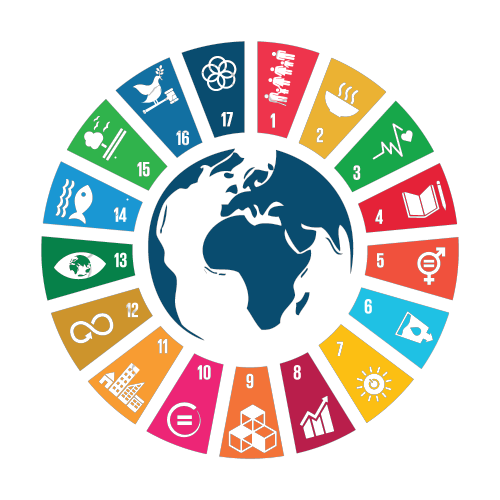

The Sustainable Development Goals (SDGs), also known as the Global Goals, were adopted by all United Nations Member States in 2015 as a universal call to action to end poverty, protect the planet and ensure that all people enjoy peace and prosperity by 2030.

The 17 SDGs are integrated---that is, they recognize that action in one area will affect outcomes in others, and that development must balance social, economic and environmental sustainability.

Achieving the SDGs requires the partnership of governments, private sector, civil society and citizens alike to make sure we leave a better planet for future generations.

For more information regarding the SDGS, please see the [UNDP website](https://www.undp.org/sustainable-development-goals). 
